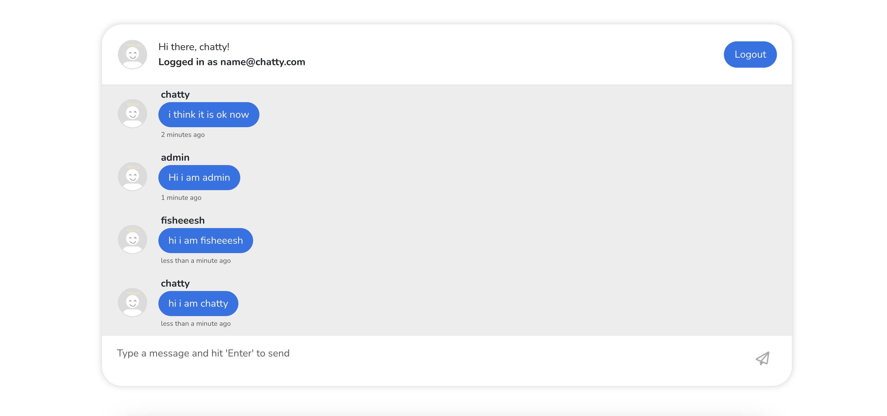

# Chatty (Live Chat Application)

Welcome to Chatty! This app allows users to engage in real-time group chats after creating an account using Firebase Authentication. Below is a detailed overview of the application’s features and functionalities.

 

## Features

- **User Authentication:** 
  - Users can create an account using their email and password.
  - Google Sign-In support for seamless authentication.
  - The authentication process is handled using Firebase Authentication.

- **Route Guards:**
  - Users must be authenticated to access the main chat room.
  - Route guards prevent unauthenticated users from entering the chat room. If a user tries to access the chat room without an account, they will be redirected to the login page.
  - Once logged in, users cannot navigate back to the login page via the URL. They can only reach the login page by logging out.
  
- **Real-Time Group Chat:**
  - Users can send and receive messages in real-time within the group chat.
  - The chat messages are stored and retrieved using Firebase Firestore, ensuring that all users can see messages as they are sent.

- **Messenger-Like Interface:**
  - Messages from the current user are displayed on the right side.
  - Messages from other users are displayed on the left, with user photos and names.

- **Persistent Session:**
  - If a user refreshes the chat room page, they will remain in the chat room instead of being redirected to the login page.


### Prerequisites

- Vue.js
- Bootstrap
- date-fns
- A Firebase project with Firestore and Authentication enabled

### Play it around here - https://chatty-1090b.web.app/

## Project setup
```
npm install
```

### Compiles and hot-reloads for development
```
npm run serve
```

### Compiles and minifies for production
```
npm run build
```

### Customize configuration
See [Configuration Reference](https://cli.vuejs.org/config/).

## License

This project is licensed under the **MIT License**.  

[](https://opensource.org/licenses/MIT)  

You can view the full license [here](LICENSE).
